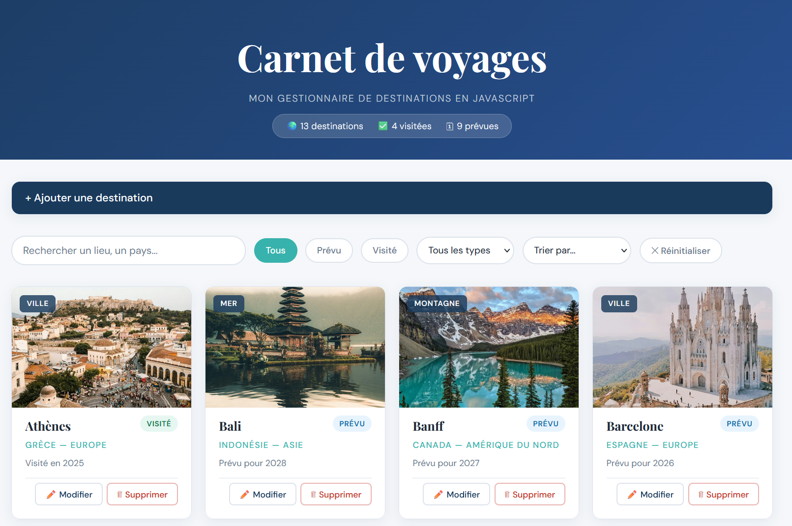
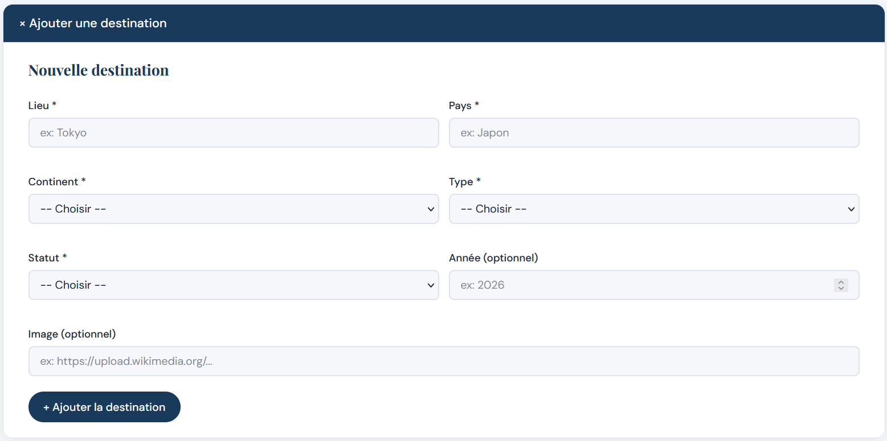

# Carnet de voyages
Projet JavaScript - Cours 122 (ESIG)

## Description

J'ai créé une application web pour gérer mes destinations de voyage. J'ai choisi ce thème car je voulais un endroit pour noter mes destinations visitées et celles que je rêve de faire un jour. Le site permet de visualiser toutes les destinations sous forme de cartes, de les filtrer, les trier, d'en ajouter de nouvelles et de les supprimer.

## Lien GitHub Pages

https://sophieborgeaud.github.io/CarnetDeVoyages/

## Fonctionnalités

- Affichage dynamique de la liste (cartes avec image, lieu, pays, statut visité/prévu, date prévue)
- Tri par lieu, pays, continent, date et statut
- Recherche en temps réel par lieu, pays ou continent
- Filtrage par statut (Tous / Prévu / Visité) et par type (Ville, Mer, Montagne, Nature)
- Ajout via formulaire avec validation des champs obligatoires
- Suppression avec confirmation
- Modification d'une destination existante
- Responsive (mobile + desktop)
- Message de feedback après ajout et suppression
- Validation de l'année (impossible de prévoir une date dans le passé)

## Captures d'écrans

## Transparence IA

### Outils utilisés

- Claude (Anthropic)
- ChatGPT (OpenAI)

J'ai utilisé ces outils comme une assistance technique et d'apprentissage durant le développement du projet.

### Prompts utilisés

- "Génère un tableau de 13 destinations de voyage avec id, lieu, pays, continent, type, statut, date, image. Voici les noms de lieux à utiliser :..."
- "Aide-moi à créer une fenêtre modale pour ajouter une destination"
- "Comment faire pour que les boutons supprimer et modifier fonctionnent sur des cartes créées dynamiquement ?"
- "Aide-moi à ajouter une validation empêchant de sélectionner une date passée pour une destination prévue"
- "Aide-moi à faire que la dernière destination ajoutée soit affichée en premier dans la liste"
- "Aide-moi à créer un compteur dans le menu de navigation qui affiche le nombre de destinations prévues et visitées"

### Ce que j'ai appris vs ce que l'IA a généré

**HTML et CSS** 
- J'ai utilisé l'IA pour générer environ 90% du code de base. Le semestre passé j'ai appris ces langages dans le module 113, donc je comprends bien ce que je manipule. J'ai fait plusieurs demandes et ajustements pour obtenir une structure qui correspondait à ma vision du projet, puis j'ai modifié et personnalisé le code pour l'adapter à mes besoins.

**JavaScript** 
- Pour les fonctionnalités vues en cours (affichage, recherche, tri, filtres, ajout, suppression), je me suis appuyée sur ce qu'on a appris en classe et sur les exercices Nuxy, avec l'aide de l'IA pour structurer et expliquer le code.

- Pour des fonctionnalités plus avancées que j'ai voulu ajouter (modification, validations supplémentaires, messages de feedback), j'ai été aidée par l'IA, en prenant soin de comprendre ce qu'elle me proposait avant de l'intégrer.

J'ai pris le temps de comprendre le code généré pour pouvoir l'adapter et l'expliquer.